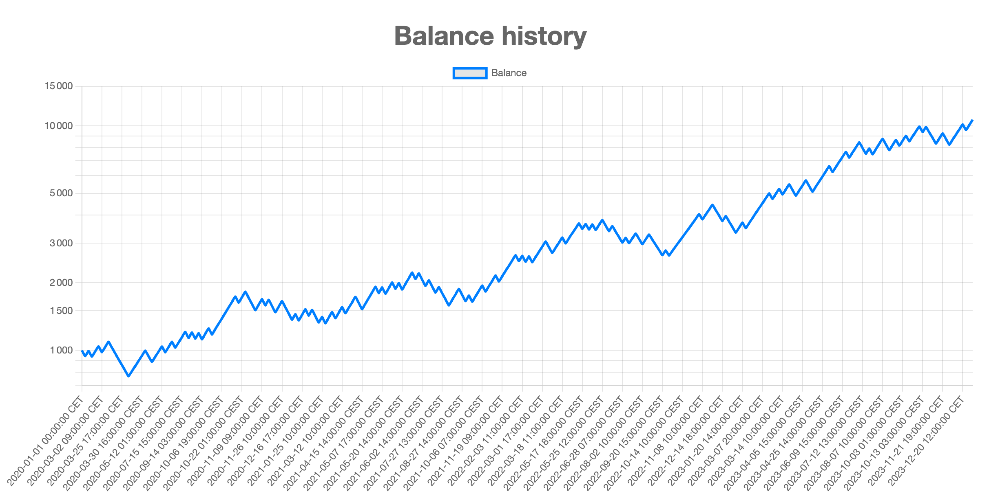
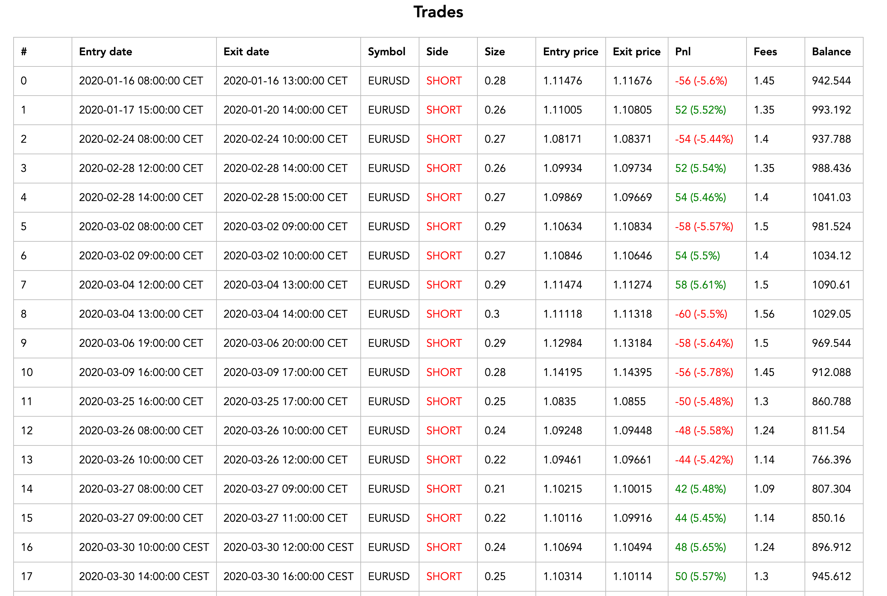

# 🤖 Trading Robots Factory

**Trading Robots Factory** is a powerful C++ project that enables you to create, train, and optimize trading robots using the neuroevolution algorithm ([NEAT](https://fr.wikipedia.org/wiki/Algorithme_NEAT)). Design your own trading strategies, leverage advanced indicators, and simulate trading in a flexible and performance-optimized environment.

---

## Features

- 🔨 **Custom Strategy Creation**: Build your own trading strategies tailored to your needs.
- ✅ **Multi-Timeframe Training**: Supports training across multiple timeframes for better adaptability.
- 🎛 **Diverse Indicators**: Utilize indicators like moving averages, Bollinger Bands, RSI, MACD, ADX, and more.
- 🕰 **Trading Session Management**: Configure precise trading sessions for optimal results.
- ⏱ **Trade Duration Control**: Limit the duration of trades as part of your strategy.
- ✅ **Money Management**: Integrate risk management into your strategies.
- 🩺 **Detailed Reports**: Automatically generate comprehensive HTML reports with strategy statistics.
- 🚀 **Cache Optimization**: Speed up training with optimized caching.
- ⏸️ **Pause and Resume**: Interrupt training anytime and resume from where you left off.
- 📁 **Save Best Strategies**: Store the top-performing strategies for future use.

---

## Getting Started

### 1. Download the Data

- Obtain historical data for a symbol as a CSV file. For example, you could use <https://forexsb.com/historical-forex-data>
- Save the file to:  
  `./data/<symbol_name>/<symbol_name>_<timeframe>.csv`
  - `<symbol_name>`: Name of the symbol in uppercase.
  - `<timeframe>`: Timeframe of the data (e.g., M1, M5, M15, M30, H1, H4, D1).
- Ensure the CSV file contains the following columns:  
  `Time, Open, High, Low, Close, Volume Spread`.
- Notive the the default separator used for reading the csv is the comma.

---

### 2. Write Your Strategy

1. **Create the Configuration File**

   - Write your strategy configuration file and save it in the `./src/configs/` folder.

2. **Update the Configuration List**

   - Modify `./src/configs/config_list.hpp` to include your new configuration file and add its `Config` variable to the `configs` list.

3. **Rebuild the Executable**

   - Compile the configuration generator using the following command:

     ```bash
     g++ -std=c++17 -o generate_json_configs -I/opt/homebrew/Cellar/boost/1.85.0/include src/generate_json_configs.cpp src/symbols.cpp src/configs/*.cpp src/indicators/*.cpp src/neat/*.cpp src/trading/*.cpp src/utils/*.cpp -L/opt/homebrew/lib -lboost_iostreams
     ```

4. **Generate the JSON Configuration Files**

   - Run the command:

     ```bash
     ./generate_json_config
     ```

   - The JSON file will be saved in the `./configs` folder.

---

### 3. Run the Training

- Start the training process by running:

  ```bash
  ./run_training <id> ./configs/<strategy_configuration_file>
  ```

- You can use the debug mode to generate logs for the traders of each generation during the training process.

  ```bash
  ./run_training <id> ./configs/<strategy_configuration_file> --debug
  ```

## Configuring Your Strategy

Refer to the example configuration provided in `./src/configs/custom/Example.hpp`.
The Config struct type is defined in the file `./src/type.hpp`.

## Reports

During each generation, the system generates in the folder `./reports/<configuration_name>/<id>/` a detailed HTML report for the best-performing strategy during the training and test period. It saves also the best strategy found in a json file.

The reports provide comprehensive statistics, enabling you to analyze and refine your approach effectively.

### Training Reports

- **Performance Overview:** Visualize key metrics to evaluate strategy success.

  

- **Balance History:** Track the evolution of account balance over time.

  

- **Monthly Returns:** Assess profitability on a month-by-month basis.

  

- **Trades Analysis:** Dive into detailed trade statistics for insights into strategy behavior.

  

- **Fitness Evolution Visualization:** Monitor the fitness progression across generations to understand how strategies improve over time.

  

### Test Reports

At each generation, the strategy is also tested during the test period to evaluate it on other data in order to try to generalize the strategy. You will also find the same report as before.

## MetaTrader 5 Integration (Work in Progress)

This feature is under development and not functional yet.

## License

[MIT.](./LICENSE)
